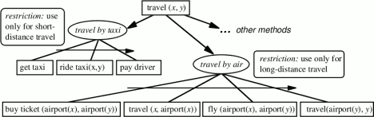

### [AIND 2018 Term 1] Carl Wennstam - Research review

---
# Research review

[TOC]

- ##### Introduction
	- ###### Definitions of AI
	- ###### Practical use
	- ###### Choice of research papers
- ##### Planning in Games: An Overview and Lessons Learned
	- ###### Classical planning (STRIPS)
	- ###### Hierarchial Networks (HTN)
	- ###### Related techniques
	- ###### Utility systems	
	- ###### Lessons learned

 - ##### PDDL: A Language with a Purpose?


## Introduction
### Definitions of AI

Several definitions of AI exist, along two dimensions Thinking (Humanly vs Rationally) and Acting (Humanly vs Rationally). **Planning** seems to be a field of AI which fits well the two definitions given by our lecturers:
>AI is programming a computer to do the right thing *when you don't know what the right things is*. - **Peter Norvig**


This is the case in planning problems, as we are generating a behavior (which is generally on the Rationalist side but might be towards the Humanist side depending on the application) without knowing what that the optimal behavior will be.

>AI is clever solutions to exponential problems. - **Thad Starner**

This is also featured here, as we are dealing with employing **search** and **planning graphs** to **NP-hard** problems.


### Practical use
So, in theory, planning seems at the heart of AI. But how useful is it? With the recent hype around **neural networks** and **deep learning**, is planning (and planning graphs) still relevant? Some of my classmates did not seem convinced.

### Choice of research papers

- Planning in Games: Planning in Games: An Overview and Lessons Learned
	- Active industry applications
	- Discusses hiearical planning

- PDDL: A Language with a Purpose?
	- critique of PDDL usefullness in theoretical and practical terms
	- dfdf

## Planning in Games: An Overview and Lessons Learned
### Classical planning (STRIPS)
Classing planning, where we go from an initial state to a goal, requires a good definition of the problem so that A* can be applied. The first major game to apply this was F.E.A.R. in 2005. A planner was implemented to generate NPC behavior. This was feasible even 13 years ago due to the problems having short sequences. The game spawned a sequel, two expansions and inspired at least 5 other title.
One of the later iterations, Stalker (2008), added a nested structure so that more complex sequences could be generated out of the core STRIPS search.
### Hierarchial Networks (HTN)
HTN searches through actions that break down **recursively** using **task decomposition** and was first featured in Killzone 2, as the designers they wanted more control over the behaviors (approaching the Acting Humanly side). A **SHOP** (Simple Hierarchial Ordered Planner) turned out a big success, and allegedly the players were often suprised that the in-game bots were not in fact online players, thereby passing a type of **Turing test**. The later game Transformers : War for Cybertron used a similar **SHOP** algorithm which also tracked the (side)effects of all actions.

Generally, SHOP focuses on two core issues in planning:
- Planners can always benefit from being faster. This research in particular aims to show how total-order forward search (where each action is applied in order from the start state) can in fact be a more efficient way to encode domain knowledge.
- For many types of planners, including HTN, their limitation is in the flexibility of the domain. Custom procedural functions can be hard to integrate when you don’t know how the planner may combine actions while planning. So instead, it can be better to limit the expressiveness of the planner (by imposing an order on the plans) to make it easy to insert custom logic.
SHOP addresses these two issues to build a planner that can solve problems more efficiently using domain knowledge encoded as custom logic. 

<p align="center"> 

</p>


### Related techniques
A **behavior tree** is similar to a HTN but stops at current action if "this is likely to work out", rather than searching the full graph. These have been in use in the industry since 2004, inspired by robotics and virtual agents from decades before.
A utility system is the term used to describe a voting/scoring system, and they are often applied to sub-systems of games like selecting objects/positions based on the results of a spread-sheet like calculation. Featured in **The Sims**.

#### Lessons learned

The biggest open questions are about design. The most significant problems to solve have been finding ways to tweak and tune the behaviors resulting from planners, optionally integrating them with level scripts, and teaching designers to think more systematically and work with emergent AIs. This has required significantly more effort than the pure algorithmic aspects of planning, and is responsible for the incremental transition towards hierarchical approaches.

In well understood domains, other techniques work best. In the cases of action/combat games, we can easily build robust AI that looks deliberate using simple reactive techniques like behavior trees. In fact, it's difficult to tell the difference for such applications between the behavior generated by a planner compared to more reactive approaches, yet the planning process will be noticeably slower at runtime and require more development time.

Planning has most benefits in **unknown domains**. Jeff Orkin mentioned in his publications that one of the benefits of planning was in prototyping, creating new behaviors quickly by letting the planner generate behavior given new actions or goals to work with. Planners also have shown to be more beneficial in open worlds, where the sandbox simulation has significantly more complexity.

Goal-based architectures are great! Regardless of whether developers use planning techniques or not, an architecture that separates the AI's goals (or WHAT to do) and the AI's decision making (or HOW to do it), has proven to be very effective. Planning research has helped crystallize this insight, and even when using reactive techniques this is arguably a best practice for AI architecture in games today.


## PDDL: A Language with a Purpose?


You can also put the [link URL][1] below the current paragraph
like [this][2].

   [1]: http://url
   [2]: http://another.url "A funky title"


## Environment requirements
- Python 3.4 or higher
- Starter code includes a copy of [companion code](https://github.com/aimacode) from the Stuart Russel/Norvig AIMA text.  


"Artificial Intelligence: A Modern Approach" 3rd edition chapter 10 *or* 2nd edition Chapter 11 on Planning, available [on the AIMA book site](http://aima.cs.berkeley.edu/2nd-ed/newchap11.pdf) sections: 

- *The Planning Problem*
- *Planning with State-space Search*

- Air Cargo Action Schema:
```
Action(Load(c, p, a),
	PRECOND: At(c, a) ∧ At(p, a) ∧ Cargo(c) ∧ Plane(p) ∧ Airport(a)
	EFFECT: ¬ At(c, a) ∧ In(c, p))
Action(Unload(c, p, a),
	PRECOND: In(c, p) ∧ At(p, a) ∧ Cargo(c) ∧ Plane(p) ∧ Airport(a)
	EFFECT: At(c, a) ∧ ¬ In(c, p))
Action(Fly(p, from, to),
	PRECOND: At(p, from) ∧ Plane(p) ∧ Airport(from) ∧ Airport(to)
	EFFECT: ¬ At(p, from) ∧ At(p, to))
```

- Problem 1 initial state and goal:
```
Init(At(C1, SFO) ∧ At(C2, JFK) 
	∧ At(P1, SFO) ∧ At(P2, JFK) 
	∧ Cargo(C1) ∧ Cargo(C2) 
	∧ Plane(P1) ∧ Plane(P2)
	∧ Airport(JFK) ∧ Airport(SFO))
Goal(At(C1, JFK) ∧ At(C2, SFO))
```
- Problem 2 initial state and goal:
```
Init(At(C1, SFO) ∧ At(C2, JFK) ∧ At(C3, ATL) 
	∧ At(P1, SFO) ∧ At(P2, JFK) ∧ At(P3, ATL) 
	∧ Cargo(C1) ∧ Cargo(C2) ∧ Cargo(C3)
	∧ Plane(P1) ∧ Plane(P2) ∧ Plane(P3)
	∧ Airport(JFK) ∧ Airport(SFO) ∧ Airport(ATL))
Goal(At(C1, JFK) ∧ At(C2, SFO) ∧ At(C3, SFO))
```
- Problem 3 initial state and goal:
```
Init(At(C1, SFO) ∧ At(C2, JFK) ∧ At(C3, ATL) ∧ At(C4, ORD) 
	∧ At(P1, SFO) ∧ At(P2, JFK) 
	∧ Cargo(C1) ∧ Cargo(C2) ∧ Cargo(C3) ∧ Cargo(C4)
	∧ Plane(P1) ∧ Plane(P2)
	∧ Airport(JFK) ∧ Airport(SFO) ∧ Airport(ATL) ∧ Airport(ORD))
Goal(At(C1, JFK) ∧ At(C3, JFK) ∧ At(C2, SFO) ∧ At(C4, SFO))
```


#### TODO: Experiment and document metrics for non-heuristic planning solution searches
* Run uninformed planning searches for `air_cargo_p1`, `air_cargo_p2`, and `air_cargo_p3`; provide metrics on number of node expansions required, number of goal tests, time elapsed, and optimality of solution for each search algorithm. Include the result of at least three of these searches, including breadth-first and depth-first, in your write-up (`breadth_first_search` and `depth_first_graph_search`). 
* If depth-first takes longer than 10 minutes for Problem 3 on your system, stop the search and provide this information in your report.
* Use the `run_search` script for your data collection: from the command line type `python run_search.py -h` to learn more.

>#### Why are we setting the problems up this way?  
>Progression planning problems can be 
solved with graph searches such as breadth-first, depth-first, and A*, where the 
nodes of the graph are "states" and edges are "actions".  A "state" is the logical 
conjunction of all boolean ground "fluents", or state variables, that are possible 
for the problem using Propositional Logic. For example, we might have a problem to 
plan the transport of one cargo, C1, on a
single available plane, P1, from one airport to another, SFO to JFK.

In this simple example, there are five fluents, or state variables, which means our state 
space could be as large as . Note the following:
>- While the initial state defines every fluent explicitly, in this case mapped to **TTFFF**, the goal may 
be a set of states.  Any state that is `True` for the fluent `At(C1,JFK)` meets the goal.
>- Even though PDDL uses variable to describe actions as "action schema", these problems
are not solved with First Order Logic.  They are solved with Propositional logic and must
therefore be defined with concrete (non-variable) actions
and literal (non-variable) fluents in state descriptions.
>- The fluents here are mapped to a simple string representing the boolean value of each fluent
in the system, e.g. **TTFFTT...TTF**.  This will be the state representation in 
the `AirCargoProblem` class and is compatible with the `Node` and `Problem` 
classes, and the search methods in the AIMA library.  


### Part 2 - Domain-independent heuristics
#### READ: Stuart Russel and Peter Norvig text
"Artificial Intelligence: A Modern Approach" 3rd edition chapter 10 *or* 2nd edition Chapter 11 on Planning, available [on the AIMA book site](http://aima.cs.berkeley.edu/2nd-ed/newchap11.pdf) section: 

- *Planning Graph*

#### TODO: Implement heuristic method in `my_air_cargo_problems.py`
- `AirCargoProblem.h_ignore_preconditions` method

#### TODO: Implement a Planning Graph with automatic heuristics in `my_planning_graph.py`
- `PlanningGraph.add_action_level` method
- `PlanningGraph.add_literal_level` method
- `PlanningGraph.inconsistent_effects_mutex` method
- `PlanningGraph.interference_mutex` method
- `PlanningGraph.competing_needs_mutex` method
- `PlanningGraph.negation_mutex` method
- `PlanningGraph.inconsistent_support_mutex` method
- `PlanningGraph.h_levelsum` method


#### TODO: Experiment and document: metrics of A* searches with these heuristics
* Run A* planning searches using the heuristics you have implemented on `air_cargo_p1`, `air_cargo_p2` and `air_cargo_p3`. Provide metrics on number of node expansions required, number of goal tests, time elapsed, and optimality of solution for each search algorithm and include the results in your report. 
* Use the `run_search` script for this purpose: from the command line type `python run_search.py -h` to learn more.

>#### Why a Planning Graph?
>The planning graph is somewhat complex, but is useful in planning because it is a polynomial-size approximation of the exponential tree that represents all possible paths. The planning graph can be used to provide automated admissible heuristics for any domain.  It can also be used as the first step in implementing GRAPHPLAN, a direct planning algorithm that you may wish to learn more about on your own (but we will not address it here).

>*Planning Graph example from the AIMA book*
>

### Part 3: Written Analysis
#### TODO: Include the following in your written analysis.  
- Provide an optimal plan for Problems 1, 2, and 3.
- Compare and contrast non-heuristic search result metrics (optimality, time elapsed, number of node expansions) for Problems 1,2, and 3. Include breadth-first, depth-first, and at least one other uninformed non-heuristic search in your comparison; Your third choice of non-heuristic search may be skipped for Problem 3 if it takes longer than 10 minutes to run, but a note in this case should be included.
- Compare and contrast heuristic search result metrics using A* with the "ignore preconditions" and "level-sum" heuristics for Problems 1, 2, and 3.
- What was the best heuristic used in these problems?  Was it better than non-heuristic search planning methods for all problems?  Why or why not?
- Provide tables or other visual aids as needed for clarity in your discussion.

## Examples and Testing:
- The planning problem for the "Have Cake and Eat it Too" problem in the book has been
implemented in the `example_have_cake` module as an example.
- The `tests` directory includes `unittest` test cases to evaluate your implementations. All tests should pass before you submit your project for review. From the AIND-Planning directory command line:
    - `python -m unittest tests.test_my_air_cargo_problems`
    - `python -m unittest tests.test_my_planning_graph`
    - You can run all the test cases with additional context by running `python -m unittest -v`
- The `run_search` script is provided for gathering metrics for various search methods on any or all of the problems and should be used for this purpose.

## Submission
Before submitting your solution to a reviewer, you are required to submit your project to Udacity's Project Assistant, which will provide some initial feedback.  

The setup is simple.  If you have not installed the client tool already, then you may do so with the command `pip install udacity-pa`.  

To submit your code to the project assistant, run `udacity submit` from within the top-level directory of this project.  You will be prompted for a username and password.  If you login using google or facebook, visit [this link](https://project-assistant.udacity.com/auth_tokens/jwt_login) for alternate login instructions.

This process will create a zipfile in your top-level directory named cargo_planning-<id>.zip.  This is the file that you should submit to the Udacity reviews system.

## Improving Execution Time

The exercises in this project can take a *long* time to run (from several seconds to a several hours) depending on the heuristics and search algorithms you choose, as well as the efficiency of your own code.  (You may want to stop and profile your code if runtimes stretch past a few minutes.) One option to improve execution time is to try installing and using [pypy3](http://pypy.org/download.html) -- a python JIT, which can accelerate execution time substantially.  Using pypy is *not* required (and thus not officially supported) -- an efficient solution to this project runs in very reasonable time on modest hardware -- but working with pypy may allow students to explore more sophisticated problems than the examples included in the project.
